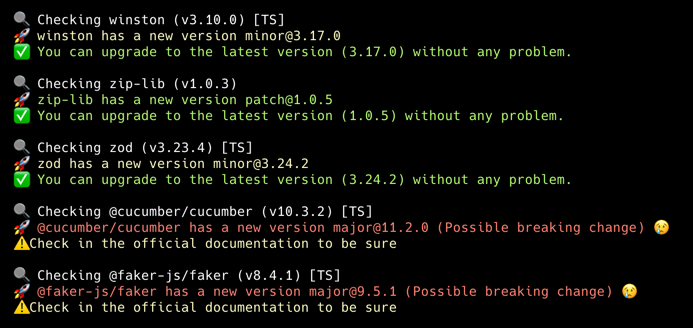

# shai-analyzer 🛠️📦

Smart Dependency Analyzer for JavaScript/TypeScript projects
Detect breaking changes before they break your app! 🔥

## ✨ What is shai-analyzer?

shai-analyzer is a CLI tool designed to analyze your project’s dependencies and detect possible breaking changes when updating packages.

🚀 It uses AI (DeepSeek-R1 B7 with Ollama) to provide precise recommendations on whether updating a package might cause issues in your project.

## ⚡ Features

- ✅ Scans your dependencies in package.json and detects outdated versions.
- ✅ Checks for breaking changes using AI-powered analysis.
- ✅ Distinguishes TypeScript support:
  - 🟢 Native TypeScript support
  - 🟡 Uses @types/package for TypeScript
  - 🔴 No TypeScript support detected
- ✅ Integrates AI to analyze changelogs for better accuracy.
- ✅ Works locally with Ollama for privacy & offline AI analysis.

## 📦 Installation

Before installing, make sure you have [Ollama](https://ollama.com/) installed and have downloaded the required AI model:

```bash
ollama pull deepseek-r1:b7
```

Then, install shai-analyzer globally via NPM:

```bash
npm install -g shai-analyzer
```

## 🚀 Usage

🔍 Scan your dependencies

Run the following command in the root of your project:
```bash
shai-analyzer scan
```

This will:
- 1️⃣ Analyze all dependencies in package.json.
- 2️⃣ Check if updates are available.
- 3️⃣ Detect breaking changes with AI.
- 4️⃣ Show TypeScript support for each dependency.

Example output:



## 🛠️ How AI is used

- 🔹 shai-analyzer uses AI to analyze the changelog of each package before updating.
- 🔹 AI is powered by Ollama with DeepSeek-R1 B7 to determine:
  - ✔️ If a package update introduces breaking changes.
  - ✔️ If changes impact TypeScript compatibility.
  - ✔️ If a safer version upgrade is recommended.

## 🛠️ Requirements

- 🔹 Node.js (v16+)
- 🔹 Ollama installed → Install Ollama
- 🔹 DeepSeek-R1 B7 model → Install with:
```bash
ollama pull deepseek-r1:b7
```

## 📜 License

This project is licensed under the MIT License.

📌 Contributions are welcome! If you find a bug or want to add features, feel free to open a pull request.